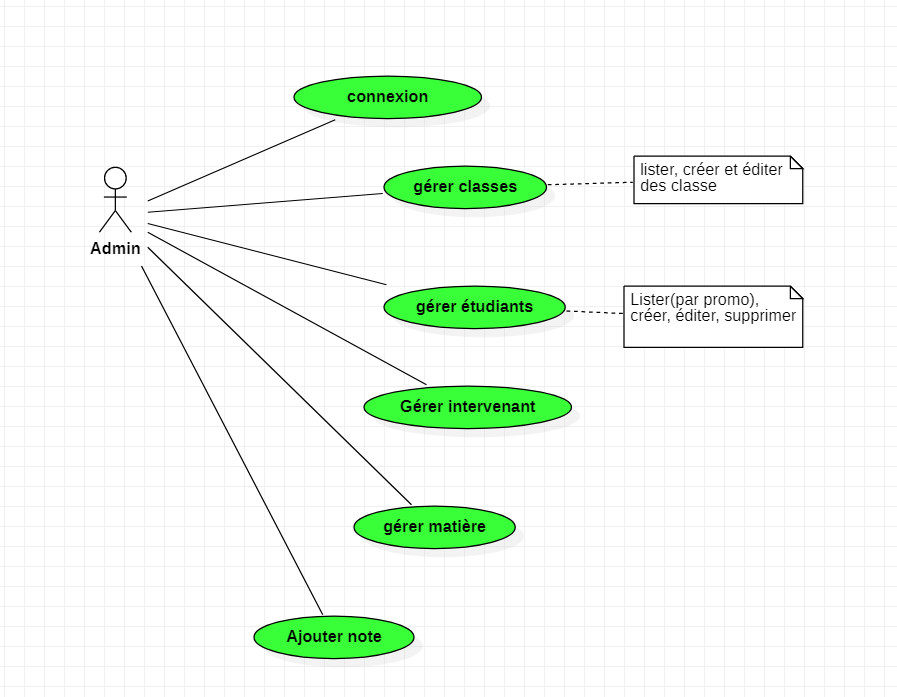
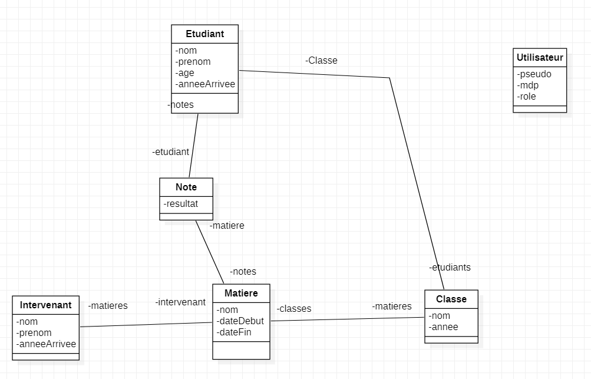

#API PHP

À l'IIM, karine, Nicolas et Alexis veulent pouvoir gérer le pole de L'IIM via une api en Symfony.

##Cas d'utilisation

L'admin du site est capable :

* De se connecter
* Gérer ses classes en les affichants
* Gérer ses étudiants
* De gérer ses intervenants
* De gerer ses matières
* Ajouter une note 

Pour la partie front j'ai utilisé du Vue.js pour rendre les éléments des pages dynamiquement.
Je n'ai pas utilisé du react car je me manquais du temps et le but principal de l'application était de créer une api en backend.

## Entité du site

### Api Plateform

Au début du projet j'ai voulu utiliser l'api plateform pour gérer mon api.  
L'api plateform est donc bien en place mais je ne l'ai pas utiliser au final.
Si cela vous intéresse vous pouver l'utiliser sur ce lien :  [http://127.0.0.1:8000/api](http://127.0.0.1:8000/api)

#### Demonstration frontEnd

[Demonstration vidéo](https://youtu.be/glp8J8ErrNs)

#####PS:  
J'ai utilisé le sytème natif d'authentification de symfony à la place de JWT.

